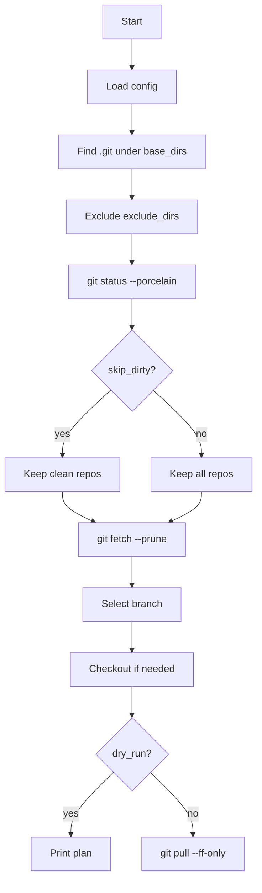

# Ansible Git Pull Automation

**Plan**
1. Verstehen, was das Playbook tut und in welcher Reihenfolge.
2. `config.pull.json` und die Wirkung jeder Einstellung prüfen.
3. Lernen, wie `dry_run` und der echte `pull` laufen und wo man Ergebnisse findet.

**Navigation**
- [Uebersicht](#overview)
- [Wie Es Funktioniert](#how-it-works)
- [Konfiguration](#config)
- [Ausfuehrung](#usage)
- [Dry Run](#dry-run)
- [Branch Auswahl](#branch-selection)
- [Logs Und Fehler](#logs-and-errors)
- [Struktur](#structure)

<a id="overview"></a>
<details>
<summary>Uebersicht</summary>

Dieses Repository enthaelt ein Ansible-Playbook, das git-Repositories unter konfigurierten Basisverzeichnissen findet, einen passenden Branch waehlt und `git pull` mit sicheren Defaults ausfuehrt.

Wichtige Defaults:
- Schmutzige Working Trees werden uebersprungen (`skip_dirty: true`).
- `git pull` wird mit `--ff-only` ausgefuehrt.
- `dry_run` zeigt einen Plan ohne echte Pulls.

</details>

<a id="how-it-works"></a>
<details>
<summary>Wie Es Funktioniert</summary>

Das Playbook `ansible/pull_all_repos.yml` macht:
1. Konfig laden aus `PULL_CONFIG` oder `config.pull.json`.
2. `.git`-Verzeichnisse in `base_dirs` finden (mit `max_depth`).
3. Pfade aus `exclude_dirs` ausschliessen.
4. `git status --porcelain` pruefen.
5. Bei `skip_dirty: true` schmutzige Repos ausschliessen.
6. `git fetch --prune <remote>`.
7. Branch nach Prioritaet auswaehlen und ggf. checkout.
8. `git pull` ausfuehren (standardmaessig `--ff-only`).



</details>

<a id="config"></a>
<details>
<summary>Konfiguration</summary>

Standard-Konfig: `config.pull.json`.

Pfadauflösung:
- Wenn `PULL_CONFIG` gesetzt und absolut ist, wird er genutzt.
- Wenn relativ, versucht das Playbook:
  - `./<config>`
  - `ansible/../<config>` (Repo-Root)

Optionen:
- `base_dirs`: Basisverzeichnisse zum Scannen.
- `exclude_dirs`: Verzeichnisse, die ausgeschlossen werden.
- `max_depth`: Tiefe fuer die Suche.
  - `1` bedeutet: Repos eine Ebene unter `base_dirs`.
  - Intern wird `+1` addiert, um `.git` zu treffen.
- `branch_priority`: Branch-Prioritaeten.
- `prefer_current`: wenn `true`, aktuelle Branch bevorzugen.
- `allow_remote_branches`: wenn `true`, lokale Branch von `origin/<branch>` anlegen.
- `remote_name`: Remote-Name fuer `fetch` und `pull` (meist `origin`).
- `pull_ff_only`: wenn `true`, `git pull --ff-only` nutzen.
- `skip_dirty`: wenn `true`, Repos mit uncommitted Changes ueberspringen.
- `dry_run`: wenn `true`, nur Plan anzeigen.

Beispiel:
```json
{
  "base_dirs": ["/home/ksv/solongoProjects", "/home/ksv/solongoApp"],
  "exclude_dirs": ["/home/ksv/solongoProjects/ansibleLocal"],
  "max_depth": 1,
  "branch_priority": ["stage", "prod", "Prod", "main", "master"],
  "prefer_current": true,
  "allow_remote_branches": true,
  "remote_name": "origin",
  "pull_ff_only": true,
  "skip_dirty": true,
  "dry_run": false
}
```

</details>

<a id="usage"></a>
<details>
<summary>Ausfuehrung</summary>

Kommandos (via `bun`):
```bash
bun run git:pull
bun run git:pull:dry
bun run git:pull:all
```

Direkt:
```bash
ansible-playbook -i localhost, -c local ansible/pull_all_repos.yml
ansible-playbook -i localhost, -c local ansible/pull_all_repos.yml -e dry_run=true
ansible-playbook -i localhost, -c local ansible/pull_all_repos.yml -e skip_dirty=false
```

Eigener Konfig-Pfad:
```bash
PULL_CONFIG=/path/to/config.pull.json ansible-playbook -i localhost, -c local ansible/pull_all_repos.yml
```

</details>

<a id="dry-run"></a>
<details>
<summary>Dry Run</summary>

`dry_run` zeigt den ausgewaehlten Branch, Checkout-Aktion und die geplante Pull-Command.
Beispiel:
```
DRY_RUN: /path/to/repo -> branch=main checkout="checkout (no-op, already on main)" pull="git pull --ff-only"
```

</details>

<a id="branch-selection"></a>
<details>
<summary>Branch Auswahl</summary>

Die Branch-Auswahl ist in `ansible/scripts/select_branch.sh` implementiert und nutzt:
- `BRANCH_PRIORITY`
- `PREFER_CURRENT`
- `ALLOW_REMOTE_BRANCHES`
- `REMOTE_NAME`
- `PULL_FF_ONLY`

Algorithmus:
1. Wenn `prefer_current` aktiv und eine aktuelle Branch existiert, nutze sie.
2. Sonst `branch_priority` pruefen (lokal zuerst, dann remote).
3. Wenn nichts passt, erste lokale Branch nehmen.
4. Wenn eine Remote-Branch gewaehlt wurde, lokale Branch daraus anlegen.

</details>

<a id="logs-and-errors"></a>
<details>
<summary>Logs Und Fehler</summary>

Das Playbook zeigt:
- uebersprungene schmutzige Repos;
- separate Fehlerlisten fuer `fetch`, `checkout` und `pull`;
- Summary der Pull-Ergebnisse.

Wenn Fehlerlisten Eintraege haben, diese Repos manuell pruefen.

</details>

<a id="structure"></a>
<details>
<summary>Struktur</summary>

- `ansible/pull_all_repos.yml` — Haupt-Playbook.
- `ansible/scripts/select_branch.sh` — Branch-Auswahl.
- `config.pull.json` — Standard-Settings.
- `package.json` — `bun`-Scripts.

</details>
