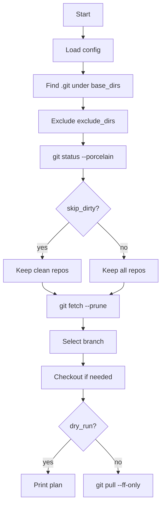

# Ansible Git Pull Automation

**Plan**
1. Understand what the playbook does and in which order.
2. Review `config.pull.json` and how each setting affects behavior.
3. Learn how to run `dry_run` vs real `pull`, and where to check results.

**Navigation**
- [Overview](#overview)
- [How It Works](#how-it-works)
- [Config](#config)
- [Usage](#usage)
- [Dry Run](#dry-run)
- [Branch Selection](#branch-selection)
- [Logs And Errors](#logs-and-errors)
- [Structure](#structure)

<a id="overview"></a>
<details>
<summary>Overview</summary>

This repository contains an Ansible playbook that finds git repositories under configured base directories, selects an appropriate branch, and runs `git pull` with safe defaults.

Key defaults:
- Dirty working trees are skipped (`skip_dirty: true`).
- `git pull` uses `--ff-only`.
- `dry_run` prints a plan without executing pulls.

</details>

<a id="how-it-works"></a>
<details>
<summary>How It Works</summary>

The playbook `ansible/pull_all_repos.yml` performs:
1. Load config from `PULL_CONFIG` or `config.pull.json`.
2. Find `.git` directories under `base_dirs` (with `max_depth`).
3. Exclude paths from `exclude_dirs`.
4. Check `git status --porcelain`.
5. If `skip_dirty: true`, filter out dirty repos.
6. `git fetch --prune <remote>`.
7. Select a branch by priority and checkout if needed.
8. Run `git pull` (`--ff-only` by default).



</details>

<a id="config"></a>
<details>
<summary>Config</summary>

Default config file: `config.pull.json`.

Config path resolution:
- If `PULL_CONFIG` is set and absolute, it is used.
- If relative, the playbook tries:
  - `./<config>`
  - `ansible/../<config>` (repo root)

Options:
- `base_dirs`: base directories to scan for repos.
- `exclude_dirs`: directories to exclude.
- `max_depth`: scan depth limit.
  - `1` means repos are one level under `base_dirs`.
  - Internally the playbook adds `+1` to include `.git`.
- `branch_priority`: branch priority order.
- `prefer_current`: if `true`, keep current branch when possible.
- `allow_remote_branches`: if `true`, allow creating a local branch from `origin/<branch>`.
- `remote_name`: remote name for `fetch` and `pull` (usually `origin`).
- `pull_ff_only`: if `true`, use `git pull --ff-only`.
- `skip_dirty`: if `true`, skip repos with uncommitted changes.
- `dry_run`: if `true`, only print the plan.

Example:
```json
{
  "base_dirs": ["/home/ksv/solongoProjects", "/home/ksv/solongoApp"],
  "exclude_dirs": ["/home/ksv/solongoProjects/ansibleLocal"],
  "max_depth": 1,
  "branch_priority": ["stage", "prod", "Prod", "main", "master"],
  "prefer_current": true,
  "allow_remote_branches": true,
  "remote_name": "origin",
  "pull_ff_only": true,
  "skip_dirty": true,
  "dry_run": false
}
```

</details>

<a id="usage"></a>
<details>
<summary>Usage</summary>

Commands (via `bun`):
```bash
bun run git:pull
bun run git:pull:dry
bun run git:pull:all
```

Direct usage:
```bash
ansible-playbook -i localhost, -c local ansible/pull_all_repos.yml
ansible-playbook -i localhost, -c local ansible/pull_all_repos.yml -e dry_run=true
ansible-playbook -i localhost, -c local ansible/pull_all_repos.yml -e skip_dirty=false
```

Custom config:
```bash
PULL_CONFIG=/path/to/config.pull.json ansible-playbook -i localhost, -c local ansible/pull_all_repos.yml
```

</details>

<a id="dry-run"></a>
<details>
<summary>Dry Run</summary>

`dry_run` prints the selected branch, checkout action, and planned pull command.
Example:
```
DRY_RUN: /path/to/repo -> branch=main checkout="checkout (no-op, already on main)" pull="git pull --ff-only"
```

</details>

<a id="branch-selection"></a>
<details>
<summary>Branch Selection</summary>

Branch selection is implemented in `ansible/scripts/select_branch.sh` and uses:
- `BRANCH_PRIORITY`
- `PREFER_CURRENT`
- `ALLOW_REMOTE_BRANCHES`
- `REMOTE_NAME`
- `PULL_FF_ONLY`

Algorithm:
1. If `prefer_current` is enabled and a current branch exists, use it.
2. Otherwise scan `branch_priority` (local first, then remote).
3. If none found, pick the first local branch.
4. If a remote branch is selected, create a local branch from it.

</details>

<a id="logs-and-errors"></a>
<details>
<summary>Logs And Errors</summary>

The playbook prints:
- skipped dirty repos;
- separate error summaries for `fetch`, `checkout`, and `pull`;
- a summary of pull results.

If any error lists are non-empty, investigate those repositories manually.

</details>

<a id="structure"></a>
<details>
<summary>Structure</summary>

- `ansible/pull_all_repos.yml` — main playbook.
- `ansible/scripts/select_branch.sh` — branch selection logic.
- `config.pull.json` — default settings.
- `package.json` — `bun` scripts.

</details>
