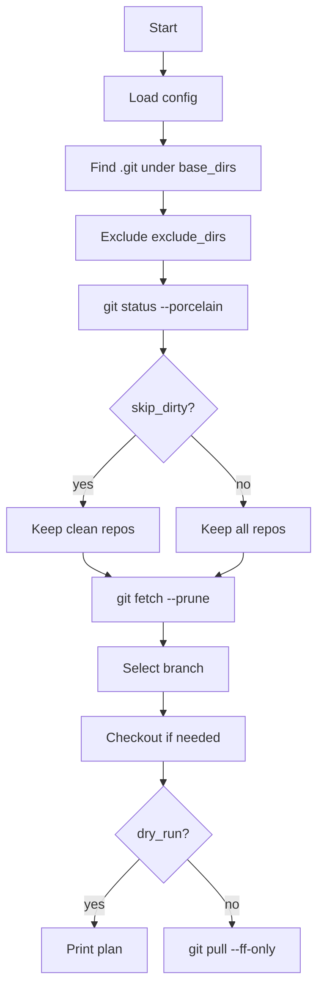

# Ansible Git Pull Automation

**План**
1. Понять, что делает плейбук и в каком порядке.
2. Разобрать `config.pull.json` и влияние каждой настройки.
3. Узнать, как запускать `dry_run` и реальный `pull`, и где смотреть результаты.

**Навигация**
- [Обзор](#overview)
- [Как это работает](#how-it-works)
- [Конфиг](#config)
- [Запуск](#usage)
- [Dry Run](#dry-run)
- [Выбор ветки](#branch-selection)
- [Логи и ошибки](#logs-and-errors)
- [Структура](#structure)

<a id="overview"></a>
<details>
<summary>Обзор</summary>

В этом репозитории есть Ansible-плейбук, который находит git-репозитории в заданных директориях, выбирает подходящую ветку и выполняет `git pull` с безопасными настройками по умолчанию.

Ключевые дефолты:
- Грязные рабочие деревья пропускаются (`skip_dirty: true`).
- `git pull` выполняется с `--ff-only`.
- `dry_run` выводит план без выполнения `pull`.

</details>

<a id="how-it-works"></a>
<details>
<summary>Как это работает</summary>

Плейбук `ansible/pull_all_repos.yml` делает:
1. Загружает конфиг из `PULL_CONFIG` или `config.pull.json`.
2. Находит `.git` в `base_dirs` (с учетом `max_depth`).
3. Исключает пути из `exclude_dirs`.
4. Проверяет `git status --porcelain`.
5. При `skip_dirty: true` исключает грязные репозитории.
6. Делает `git fetch --prune <remote>`.
7. Выбирает ветку по приоритету и делает checkout при необходимости.
8. Выполняет `git pull` (по умолчанию `--ff-only`).



</details>

<a id="config"></a>
<details>
<summary>Конфиг</summary>

Конфиг по умолчанию: `config.pull.json`.

Как ищется конфиг:
- Если `PULL_CONFIG` задан и это абсолютный путь, он используется.
- Если путь относительный, пробуются:
  - `./<config>`
  - `ansible/../<config>` (корень репозитория)

Опции:
- `base_dirs`: базовые директории для поиска репозиториев.
- `exclude_dirs`: директории, которые нужно исключить.
- `max_depth`: ограничение глубины поиска.
  - `1` означает, что репозитории на один уровень ниже `base_dirs`.
  - Внутри плейбук добавляет `+1`, чтобы учесть `.git`.
- `branch_priority`: приоритет веток.
- `prefer_current`: если `true`, использовать текущую ветку.
- `allow_remote_branches`: если `true`, можно создать локальную ветку из `origin/<branch>`.
- `remote_name`: имя remote для `fetch` и `pull` (обычно `origin`).
- `pull_ff_only`: если `true`, использовать `git pull --ff-only`.
- `skip_dirty`: если `true`, пропускать репы с незакоммиченными изменениями.
- `dry_run`: если `true`, только показывать план.

Пример:
```json
{
  "base_dirs": ["/home/ksv/solongoProjects", "/home/ksv/solongoApp"],
  "exclude_dirs": ["/home/ksv/solongoProjects/ansibleLocal"],
  "max_depth": 1,
  "branch_priority": ["stage", "prod", "Prod", "main", "master"],
  "prefer_current": true,
  "allow_remote_branches": true,
  "remote_name": "origin",
  "pull_ff_only": true,
  "skip_dirty": true,
  "dry_run": false
}
```

</details>

<a id="usage"></a>
<details>
<summary>Запуск</summary>

Команды (через `bun`):
```bash
bun run git:pull
bun run git:pull:dry
bun run git:pull:all
```

Прямой запуск:
```bash
ansible-playbook -i localhost, -c local ansible/pull_all_repos.yml
ansible-playbook -i localhost, -c local ansible/pull_all_repos.yml -e dry_run=true
ansible-playbook -i localhost, -c local ansible/pull_all_repos.yml -e skip_dirty=false
```

Кастомный конфиг:
```bash
PULL_CONFIG=/path/to/config.pull.json ansible-playbook -i localhost, -c local ansible/pull_all_repos.yml
```

</details>

<a id="dry-run"></a>
<details>
<summary>Dry Run</summary>

В режиме `dry_run` показывается выбранная ветка, checkout и команда `pull`.
Пример:
```
DRY_RUN: /path/to/repo -> branch=main checkout="checkout (no-op, already on main)" pull="git pull --ff-only"
```

</details>

<a id="branch-selection"></a>
<details>
<summary>Выбор ветки</summary>

Логика выбора ветки находится в `ansible/scripts/select_branch.sh` и использует:
- `BRANCH_PRIORITY`
- `PREFER_CURRENT`
- `ALLOW_REMOTE_BRANCHES`
- `REMOTE_NAME`
- `PULL_FF_ONLY`

Алгоритм:
1. Если `prefer_current` включен и есть текущая ветка, выбрать ее.
2. Иначе пройти по `branch_priority` (сначала локальные, потом удаленные).
3. Если ничего не найдено, взять первую локальную ветку.
4. Если выбрана удаленная ветка, создать локальную от нее.

</details>

<a id="logs-and-errors"></a>
<details>
<summary>Логи и ошибки</summary>

Плейбук выводит:
- список пропущенных грязных репозиториев;
- отдельные списки ошибок для `fetch`, `checkout` и `pull`;
- summary по результатам `pull`.

Если в списках ошибок есть записи, эти репозитории нужно разбирать вручную.

</details>

<a id="structure"></a>
<details>
<summary>Структура</summary>

- `ansible/pull_all_repos.yml` — основной плейбук.
- `ansible/scripts/select_branch.sh` — логика выбора ветки.
- `config.pull.json` — настройки по умолчанию.
- `package.json` — скрипты `bun`.

</details>
